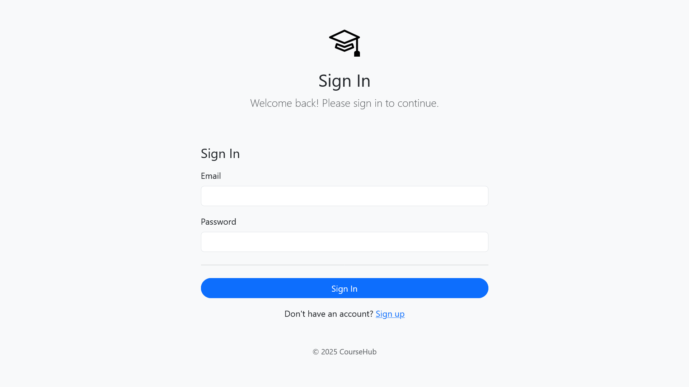
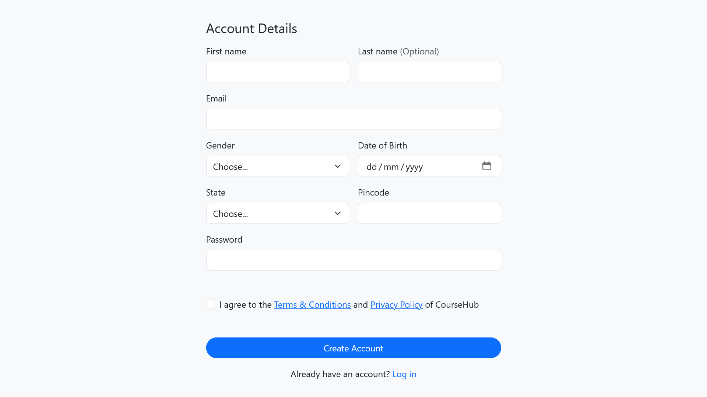
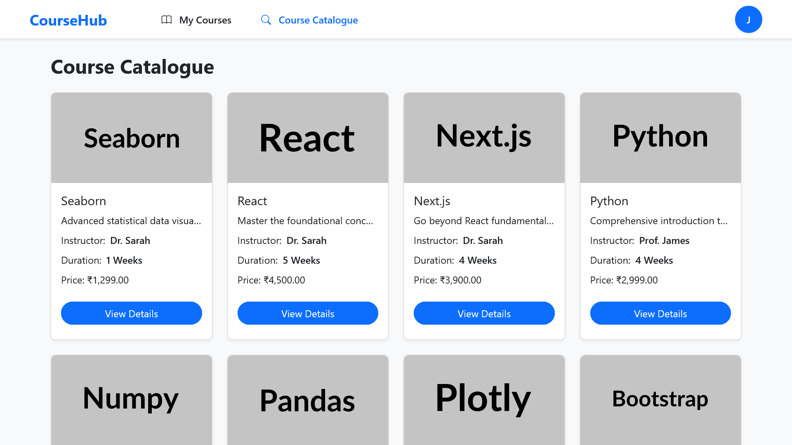
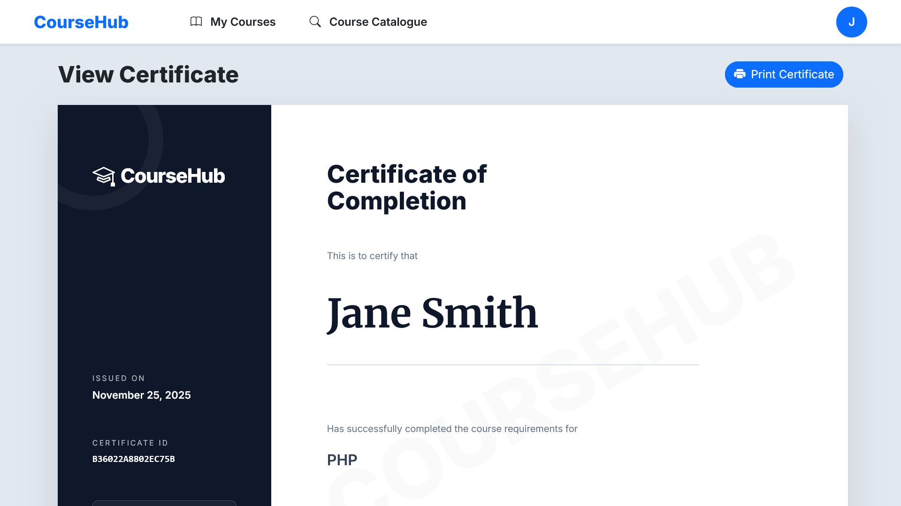

# CourseHub

Welcome to **CourseHub**, a comprehensive platform designed to facilitate online learning and course management. This full-stack web application is built with PHP and MySQL, delivering a seamless experience for students and administrators alike.

## Project Description

CourseHub is a web-based application that allows users to browse courses, enroll in them, and track their progress. It aims to provide a seamless experience for both students and administrators. The application is built with a focus on simplicity and usability.

## Features

-   **Course Catalogue**: Browse through a variety of available courses.
-   **My Courses**: Track enrolled courses and progress.
-   **Certificate Generation**: Users can view and download certificates upon course completion.
-   **Responsive Design**: The application is mobile-friendly, built with Bootstrap.

## Tech Stack

-   **Frontend**: HTML, CSS, Bootstrap 5, JavaScript
-   **Backend**: PHP
-   **Database**: MySQL

## Screenshots

Screenshots of the application:

### Login Page

### Signup Page

### Course Catalogue

### My Courses

### Certificate Page

## Installation Instructions

To run this project locally on your machine, follow the steps below:

1. **Install XAMPP**: Ensure you have XAMPP installed on your system.
2. **Clone the Repository**: Download or clone this repository to your `htdocs` folder as `coursehub` (usually `C:\xampp\htdocs\coursehub`).
3. **Database Setup**:
   - Open phpMyAdmin (`http://localhost/phpmyadmin`).
   - Create a new database named `coursehub`.
   - Import the `coursehub.sql` file located in the `SQL` folder of this project.
4. **Configuration**:
   - The database configuration is located in `db.php`.
   - Ensure the credentials in `db.php` match your local MySQL setup (Default: User `root`, Password empty).
5. **Run the Application**:
   - Open your web browser.
   - Navigate to `http://localhost/coursehub`.
